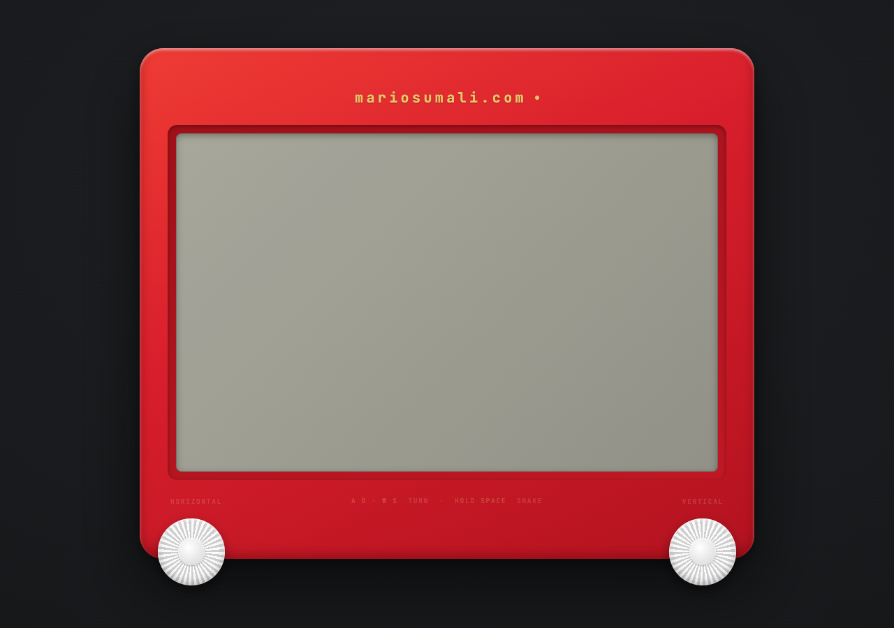
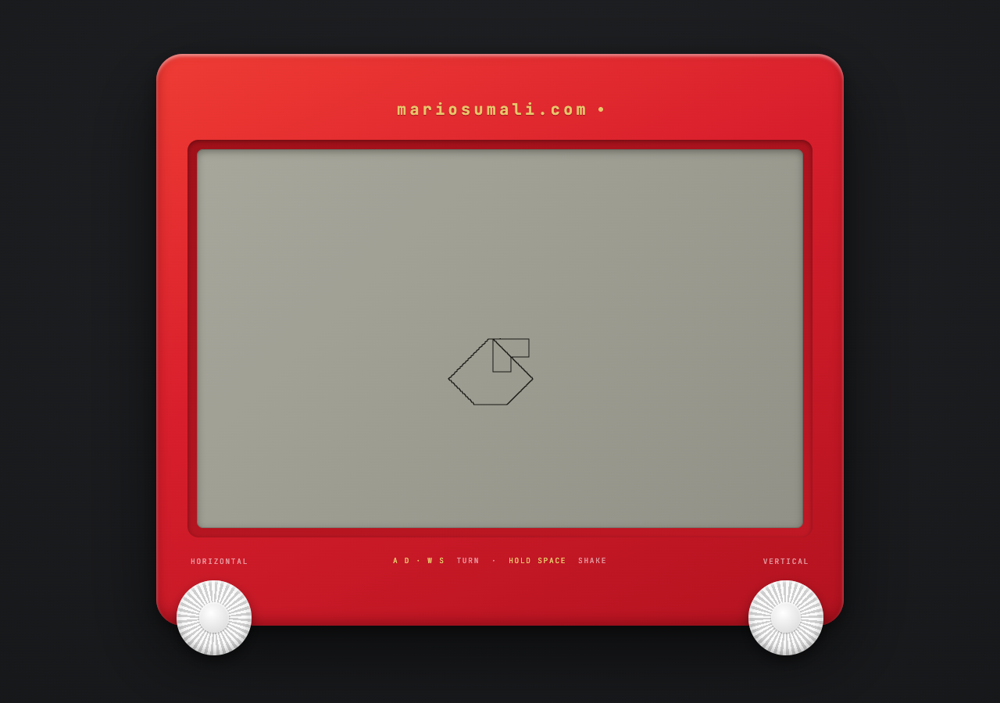

# Etch A Sketch

A browser-based Etch A Sketch.

## Try it

Open `Etch.dc.html` in a browser.

## Controls

- **A / D** or **←/→** — move horizontal
- **W / S** or **↑/↓** — move vertical
- Drag the knobs directly with your mouse or finger, they have real momentum
- **Hold Space** — shake the whole thing and erase the screen
- Shaking the mouse back and forth fast enough also triggers an erase
- On a phone or tablet with a motion sensor, physically shaking the device erases it too

